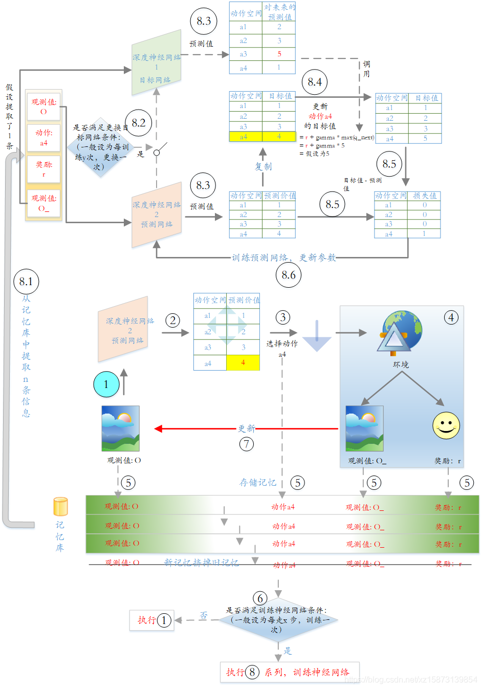
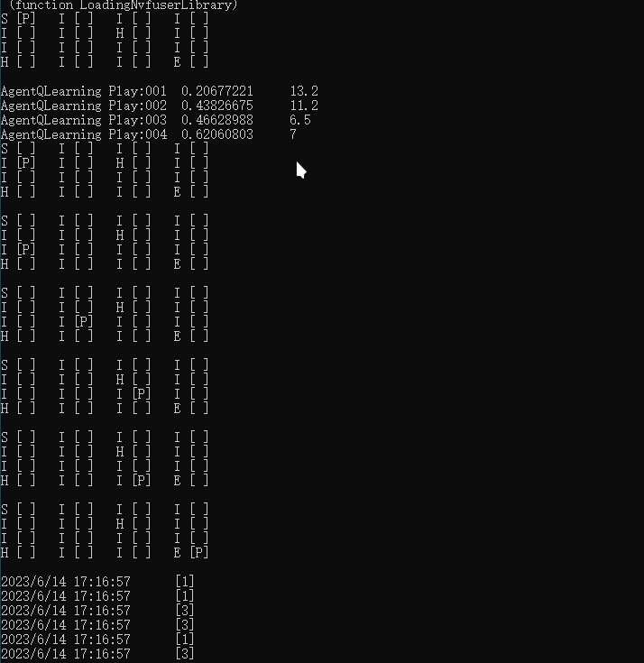

# ReinforcementLearning
Secondary development by torchsharp for Deep Learning and Reinforcement Learning

[Playing Atari with Deep Reinforcement Learning](https://arxiv.org/pdf/1312.5602.pdf)


## DataSet 

Todo

``` C#
public class IrisData : DataView
{
    /// <summary>
    /// </summary>
    public IrisData()
    {
    }

    [StreamHeader(0)] public float Label { set; get; }
    [StreamHeader(1)] public float SepalLength { set; get; }
    [StreamHeader(2)] public float SepalWidth { set; get; }
    [StreamHeader(3)] public float PetalLength { set; get; }
    [StreamHeader(4)] public float PetalWidth { set; get; }

    public override torch.Tensor GetFeatures()
    {
        return torch.tensor(new[] {SepalLength, SepalWidth, PetalLength, PetalWidth});
    }

    public override torch.Tensor GetLabels()
    {
        return torch.tensor(new[] {Label});
    }

      
}
```


``` C#
var dataset = new Dataset<IrisData>(@"F:\Iris\iris-train.txt");
var res = dataset.GetTensor(0);
Print(res);
```


## DataLoader

``` C#
var dataset = new Dataset<IrisData>(@"F:\Iris\iris-train.txt");
var dataConfig = new DataLoaderConfig
{
    Device = new torch.Device(DeviceType.CUDA)
};
var dataloader = new DataLoader<IrisData>(dataset, dataConfig);

using var iterator = dataloader.GetEnumerator();
while (iterator.MoveNext())
{
    var current = iterator.Current;
    Print(current);
}
```

## InfiniteDataLoader

```c#

var dataset = new Dataset<IrisData>(@"F:\Iris\iris-train.txt");
var dataConfig = new DataLoaderConfig();
var dataloader = new InfiniteDataLoader<IrisData>(dataset, dataConfig);

await foreach (var a in dataloader.GetBatchSample(100))
{
    var array = a.Labels.data<float>().ToArray();
    Print($"{string.Join(";", array)}");
}
```


## RL

### AgentCrossEntropy

Slove KArmedBandit Problem by Cross Entropy Deep Reinforcement Learning

1. Develop  KArmedBandit which Inherit  from Environ
2. Create KArmedBandit with 4 Bandit
3. Create AgentCrossEntropy by send KArmedBandit
4. Learn by Epoch
    1. Get Batch Episodes
    2. Filter Elite from Batch Episodes
    3. Agent learn by  Elite
    4. Next epoch until exit learn.


``` c#
var epoch = 100;
var episodesEachBatch = 20;
var device = new torch.Device(DeviceType.CUDA);

/// Step 1 Create a 4-Armed Bandit
var kArmedBandit = new KArmedBandit(2, device);
Print(kArmedBandit);

/// Step 2 Create AgentCrossEntropy with 0.7f percentElite as default
var agent = new AgentCrossEntropy(kArmedBandit);

/// Step 3 Learn and Optimize
foreach (var i in Enumerable.Range(0, epoch))
{
    var batch = kArmedBandit.GetMultiEpisodes(agent, episodesEachBatch);
    var eliteOars = agent.GetElite(batch); /// Get eliteOars 

    /// Agent Learn by elite observation & action
    var loss = agent.Learn(eliteOars);
    var rewardMean = batch.Select(a => a.SumReward.Value).Average();

    Print($"Epoch:{i:D4}\tReward:{rewardMean:F4}\tLoss:{loss:F4}");
}
```


### AgentCrossEntropy With memory and Discount factor
1. Introducing discount factor 
2. Increased memory function to retain elite fragments

``` c#
var epoch = 5000;
var episodesEachBatch = 100;

/// Step 1 Create a 4-Armed Bandit
var forFrozenLake = new Frozenlake(Device)
{
    Gamma = 0.90f
};
Print(forFrozenLake);

/// Step 2 Create AgentCrossEntropy with 0.7f percentElite as default
var agent = new AgentCrossEntropyExt(forFrozenLake)
{
    MemsEliteLength = 30
};

/// Step 3 Learn and Optimize
foreach (var i in Enumerable.Range(0, epoch))
{
    var batch = forFrozenLake.GetMultiEpisodes(agent, episodesEachBatch);
    var success = batch.Count(a => a.SumReward.Value > 0);

    var eliteOars = agent.GetElite(batch); /// Get eliteOars 

    /// Agent Learn by elite observation & action
    var loss = agent.Learn(eliteOars);
    var rewardMean = batch.Select(a => a.SumReward.Value).Sum();

    Print($"Epoch:{i:D4}\t:\t{success}\tReward:{rewardMean:F4}\tLoss:{loss:F4}");
}
```

### QLearning (Frozen Lake)

1. Create a Forzen Lake wihch smooth Probs is [0.7,0.15,0.15]
2. Learn By Sample 100 Episodes
3. Test by 10 Episodes also add to Agent's experience
4. When Reward is fine. Stop Learn else go to step 2.
5. Set smooth Probs  to [1,0,0], means will to targer without fail.
6. Get a Episode to show a best path to the goal of Lake.

```C#
 /// Step 1 Create a 4-Armed Bandit
var frozenLake = new Frozenlake(deviceType: DeviceType.CPU) {Gamma = 0.95f};

/// Step 2 Create AgentCrossEntropy with 0.7f percentElite as default
var agent = new AgentQLearning(frozenLake);
Print(frozenLake);

var i = 0;
var testEpisode = 10;
var bestReward = 0f;
while (true)
{
    agent.Learn(100);

    var episode = agent.PlayEpisode(testEpisode);

    var episodeLevel = frozenLake.GetReward(episode);

    bestReward = new[] {bestReward, episodeLevel.Reward}.Max();
    Print($"{agent} Play:{++i:D3}\t {episodeLevel}");
    if (bestReward > 0.6)
        break;
}

frozenLake.ChangeToRough();
frozenLake.CallBack = s => { Print(frozenLake); };
var e = agent.PlayEpisode();
var act = e.Steps.Select(a => a.Action);
Print(string.Join("\r\n", act));
```

