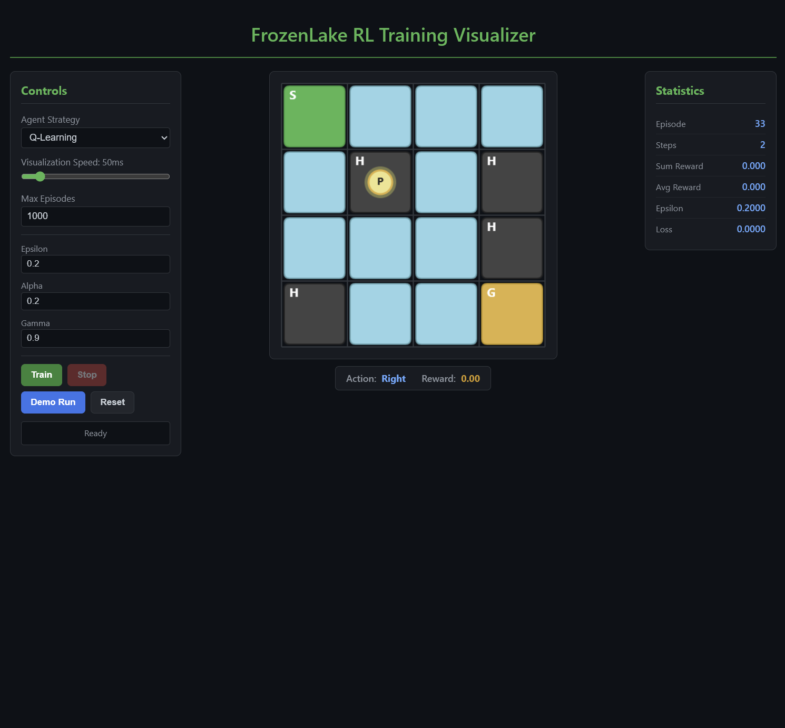

# RLSharp

RLSharp is a reinforcement learning library for .NET. The public entry point is a pure .NET Core API: application code defines its own state, action, environment, and reward model, then uses RLSharp agents to train, save, load, and run policies in real systems. TorchSharp is used only by the `RLSharp.Torch` backend.

## Features

- Pure .NET environment and policy interfaces in `RLSharp.Core`.
- Train/inference separation through `IAgent<TState,TAction>` and `IPolicy<TState,TAction>`.
- TorchSharp-backed generic agents for custom state/action types.
- Legacy tensor-first algorithms and FrozenLake web visualizer retained for compatibility.
- Console sample and xUnit test suite.

## Requirements

- .NET 8 SDK
- Windows, Linux, or macOS
- CPU TorchSharp runtime through `TorchSharp-cpu` for `RLSharp.Torch`

## Project Structure

```text
RLSharp
|-- src
|   |-- RLSharp.Core                 Pure .NET abstractions and trainer
|   |-- RLSharp.Torch                TorchSharp backend, encoders, generic agents
|   |-- RLSharp.FrozenLake.Web       FrozenLake ASP.NET Core visualizer
|   |-- RLSharp.Samples.Console      Console sample
|   |-- RLSharp.Tests                xUnit tests
|   `-- RLSharp.sln
|-- images
`-- resources
```

`RLSharp.Core` does not reference TorchSharp and does not expose tensors in its public API.

## Build

```powershell
dotnet restore src/RLSharp.sln
dotnet build src/RLSharp.sln --no-restore
```

## Generic Library Quick Start

Define your domain state/action and implement an environment:

```csharp
using RLSharp.Core.Environments;
using RLSharp.Core.Spaces;

public enum MoveAction { Left, Right }

public sealed class LineWorld : IEnvironment<int, MoveAction>
{
    private int _state;

    public string Name => "LineWorld";
    public IActionSpace<MoveAction> ActionSpace { get; } =
        new DiscreteActionSpace<MoveAction>(Enum.GetValues<MoveAction>());

    public int Reset()
    {
        _state = 0;
        return _state;
    }

    public StepResult<int> Step(MoveAction action)
    {
        _state = action == MoveAction.Right ? Math.Min(2, _state + 1) : Math.Max(0, _state - 1);
        return new StepResult<int>(_state, _state == 2 ? 1f : 0f, _state == 2);
    }
}
```

Train a generic agent and save it:

```csharp
using RLSharp.Core.Training;
using RLSharp.Torch.Agents.Generic;
using RLSharp.Torch.Encoding;

static float[] EncodeState(int state)
{
    var values = new float[3];
    values[state] = 1f;
    return values;
}

var environment = new LineWorld();
var encoder = new DelegateStateEncoder<int>(3, EncodeState);
var agent = new DqnAgent<int, MoveAction>(environment, encoder);
var trainer = new Trainer<int, MoveAction>(agent);

trainer.Train(new TrainingOptions { MaxEpisodes = 100, CheckpointPath = "lineworld.dat" });
```

Use the trained policy in a real system without an environment:

```csharp
var liveState = 0;
MoveAction action = agent.Policy.SelectAction(liveState);
```

The same pattern applies to `QLearningAgent<TState,TAction>`, `DqnAgent<TState,TAction>`, and `PpoAgent<TState,TAction>`.

## Core API

| Type | Purpose |
| --- | --- |
| `IEnvironment<TState,TAction>` | User-defined training environment with `Reset()` and `Step(action)`. |
| `IActionSpace<TAction>` | Defines valid actions and random sampling. |
| `IAgent<TState,TAction>` | Trainable policy with `Learn()`, `SelectAction()`, `Save()`, and `Load()`. |
| `IPolicy<TState,TAction>` | Inference-only policy for deployment. |
| `Trainer<TState,TAction>` | Reusable training loop with stop/checkpoint options. |
| `Transition<TState,TAction>` / `Episode<TState,TAction>` | Pure .NET training data models. |

## Included Algorithms

| Category | Implementations |
| --- | --- |
| Generic discrete agents | QLearningAgent, DqnAgent, PpoAgent |
| Legacy tabular methods | Q-Learning, SARSA, on-policy Monte Carlo, off-policy Monte Carlo |
| Legacy deep value methods | DQN, Double DQN, Dueling DQN, Noisy DQN, Categorical DQN, CGP |
| Legacy policy gradient | REINFORCE, Cross Entropy, PPO |
| Legacy actor-critic | Actor-Critic, A2C, A3C |
| Continuous control boundaries | DDPG, TD3, SAC |

DDPG, TD3, and SAC are present as Torch-layer boundaries for the next continuous-control phase. They require a continuous action-space adapter before full training support.

## Running Samples

Console sample:

```powershell
dotnet run --project src/RLSharp.Samples.Console/RLSharp.Samples.Console.csproj
```

FrozenLake web visualizer:

```powershell
dotnet run --project src/RLSharp.FrozenLake.Web/RLSharp.FrozenLake.Web.csproj
```

Default development URL:

```text
http://localhost:5111
```

Preview:



## Testing

Run the default fast test suite:

```powershell
dotnet test src/RLSharp.Tests/RLSharp.Tests.csproj
```

Run the generic library API tests explicitly:

```powershell
dotnet test src/RLSharp.Tests/RLSharp.Tests.csproj --filter "FullyQualifiedName~GenericLibraryApiTest"
```

## Development Notes

- NuGet package versions are managed in `Directory.Packages.props`.
- `RLSharp.Core` must remain TorchSharp-free.
- TorchSharp tensors should not leak through new public Core APIs.
- Legacy tensor-first APIs remain available while algorithms migrate to the generic Core model.

## License

RLSharp is available under the MIT License.
